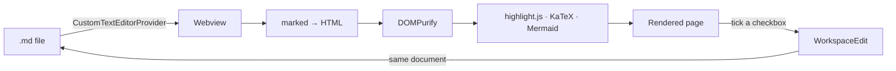

# MD Reader for VS Code

A clean, readable Markdown preview for VS Code — tables, callouts, Mermaid diagrams, math, syntax highlighting and tickable checkboxes, matching your VS Code theme automatically. It replaces the flat default preview with something closer to how GitHub or GitLab render a document.

It installs as a single extension, needs no setup step, and runs the same on Windows, macOS and Linux.

## Installing

**From the Marketplace** (the usual way): open the **Extensions** view in VS Code (`Ctrl+Shift+X`), search for **MD Reader**, and click **Install**. That's it — nothing downloads at runtime afterward, since every library the renderer uses is already bundled inside the extension.

**From a `.vsix` file** (if you were given one directly, or built it yourself):

1. **Extensions** view (`Ctrl+Shift+X`) → **...** menu at the top → **Install from VSIX...**
2. Pick the `.vsix` file.

Or from a terminal:

```bash
code --install-extension md-reader-preview-1.0.0.vsix
```

**From source**, if you want to build it yourself:

```bash
npm install
npm run package   # produces md-reader-<version>.vsix
```

## Using it

- **Open a file with it:** right-click a `.md` file (in the editor tab or the Explorer) → **MD Reader: Open Preview to the Side**, or run that command from the Command Palette (`Ctrl+Shift+P`). The shortcut `Ctrl+Shift+M` does the same while a Markdown file is active.
- **Opening a `.md` file already uses MD Reader by default** — nothing to configure. If you'd rather edit raw text first and open the preview only when you ask for it, run **MD Reader: Use as Default Editor for Markdown Files** in reverse: open **Settings** (`Ctrl+,`), search `editor associations`, and remove the `*.md` entry — or right-click a `.md` tab → **Reopen Editor With...** → **Text Editor** for a one-off.
- **See the raw text:** click the `</>` icon in the editor toolbar (**MD Reader: View Source**), which reopens the same file as a normal text editor.
- **Jump between headings:** the Explorer sidebar (left, same place as Outline and Timeline) gets an **On This Page** panel listing the document's headings — click one to scroll straight to it. Hide or restore it like any other Explorer view: right-click its header → **Hide 'On This Page'**, or toggle it back from any view's header menu.
- **Tick a checkbox:** click any `- [ ]` task, or any table cell that contains only `[ ]` / `[x]` (an MD Reader extra — GitHub and GitLab show those as plain text). The tick is written into the file as a real edit: `Ctrl+Z` undoes it, and nothing touches disk until you save, exactly like typing.
- **Export a copy:** **MD Reader: Export as Standalone HTML...** saves a self-contained HTML file you can send to someone without VS Code.

## What it renders

- GitHub / GitLab flavoured Markdown: tables, task lists, strikethrough, autolinks, `<details>` blocks, YAML front matter shown as a collapsible "Metadata" panel.
- Code blocks with syntax highlighting and a copy button.
- ` ```mermaid ` diagrams.
- Math: `$inline$`, `$$block$$`, and ` ```math ` blocks, via KaTeX.
- Callouts: `> [!NOTE]`, `[!TIP]`, `[!IMPORTANT]`, `[!WARNING]`, `[!CAUTION]`.
- Relative links to other Markdown files open inside MD Reader; links to other file types open with your usual viewer; images resolve from disk.

## How it works



- **Rendering** happens inside a VS Code **webview** — an isolated page, not the extension itself — using [marked](https://marked.js.org), cleaned with [DOMPurify](https://github.com/cure53/DOMPurify), highlighted with [highlight.js](https://highlightjs.org), and diagrammed/typeset with [Mermaid](https://mermaid.js.org) and [KaTeX](https://katex.org). The page updates live as you (or anything else) edit the file, not just on save.
- **Theme** comes from CSS variables VS Code injects into every webview (`--vscode-editor-background` and friends), so there's no separate light/dark setting to keep in sync.
- **Checkbox edits** go through a `vscode.WorkspaceEdit`, changing exactly the one character between `[` and `]`. Before applying it, the extension re-parses the file with `marked` itself and checks that result agrees with both the raw text and what the page displayed — if anything disagrees (for example, text that only *looks* like a task inside a code block), the edit is refused rather than risking the wrong line.
- **Links and images** are resolved by the extension (not the webview), which only has access to the current workspace folder — a webview normally can't reach the filesystem directly.
- Nothing is downloaded at runtime: all three bundled libraries ship inside the `.vsix`.

## Limitations

- Each preview tab is tied to one `TextDocument`. Opening the same file in two preview tabs side by side keeps them both in sync with that document, same as two text editors on one file.
- Checkboxes are declined (left un-clickable) when `marked`'s own parse of the file disagrees with the plain-text scan — this is deliberately conservative to avoid ever editing the wrong line.
- A Markdown file opened outside any workspace folder can only resolve images/links in its own directory (and one level up), same restriction a plain webview has.

## Project structure

```
md-reader-vscode/
├── package.json          # Extension manifest: commands, keybindings, menus
├── src/
│   ├── extension.ts       # Activation, command registration
│   ├── mdReaderEditor.ts  # The custom editor: webview, messaging, file edits
│   └── taskEdit.ts        # Finds & safety-checks checkbox offsets in the text
├── media/
│   ├── main.js, style.css # The webview's renderer
│   └── vendor/             # marked, DOMPurify, highlight.js, KaTeX, Mermaid
├── esbuild.js             # Bundles src/ → dist/extension.js
└── LICENSE, CHANGELOG.md
```

### Building

```bash
npm install
npm run watch      # rebuild on change, for development (press F5 in VS Code to debug)
npm run build      # one-off production build
npm run package    # build + produce a .vsix
```

## Third-party libraries

Bundled inside the extension, each under its own license:

| Library | License |
|---|---|
| [marked](https://github.com/markedjs/marked) | MIT |
| [DOMPurify](https://github.com/cure53/DOMPurify) | Apache-2.0 or MPL-2.0 |
| [highlight.js](https://github.com/highlightjs/highlight.js) | BSD-3-Clause |
| [KaTeX](https://github.com/KaTeX/KaTeX), including its fonts | MIT |
| [Mermaid](https://github.com/mermaid-js/mermaid) | MIT |

## License

Released under the MIT License (see `LICENSE`).
